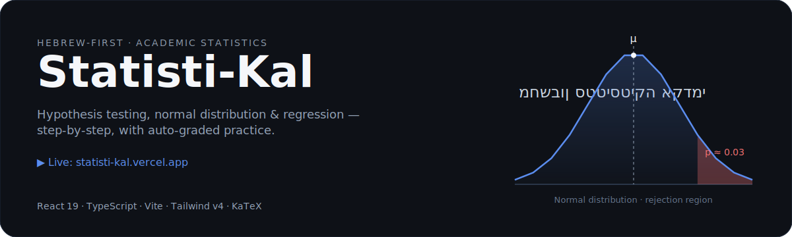
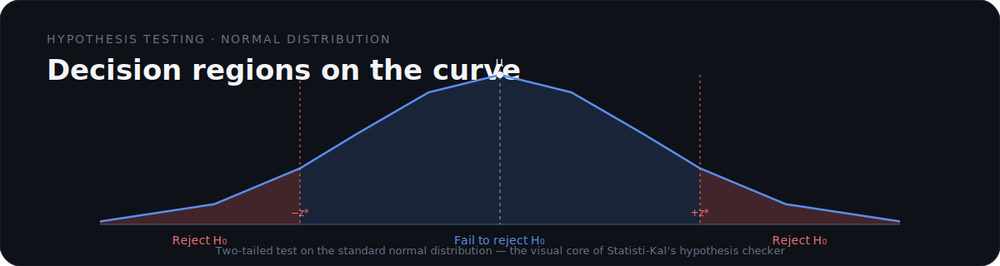

<div align="center">



**מחשבון סטטיסטיקה אקדמי בעברית — בדיקת השערות, התפלגות נורמלית, רגרסיה ו"בחן את עצמך" עם ציון אוטומטי**

[🚀 נסו את האפליקציה החיה](https://statisti-kal.vercel.app/)

</div>

## מה זה עושה · What it does

Statisti-Kal is a Hebrew-first (RTL) academic statistics instrument for students. It turns textbook procedures into guided, visual, self-checking practice — no prior statistics software required.

| כלי · Tool | תיאור · Description |
| --- | --- |
| **בדיקת השערות** · Hypothesis testing | תהליך מונחה צעד-אחר-צעד עם פעמון גרפי, אזורי קבלה ודחייה, וחישוב p-value. |
| **התפלגות נורמלית** · Normal distribution | פתרון בעיות הסתברות (רגיל והפוך) על פעמון גאוס אינטראקטיבי. |
| **דפי נוסחאות וטבלאות** · Formula sheets | גישה מהירה לכלי עזר סטטיסטיים מסורתיים בפורמט דיגיטלי. |
| **"בחן את עצמך"** · Self-check | תרגול עם ציון אוטומטי ומשוב מיידי. |
| **RTL + KaTeX** · Hebrew-native | ממשק ימין-לשמאל עם רינדור נוסחאות מדויק. |



## איך זה עובד · How it works

1. **בוחרים כלי** — בדיקת השערות, התפלגות נורמלית, או דף נוסחאות.
2. **מזינים נתונים** — המערכת מדריכה צעד אחר צעד, עם המחשה חזותית בכל שלב.
3. **מקבלים תוצאה** — פעמון, אזורי החלטה, p-value וציון כשנדרש.

## התחלה מהירה · Quick start

```bash
cd web
npm install
npm run dev
```

האפליקציה תרוץ בכתובת `http://localhost:3000`.

## טכנולוגיות · Tech stack

React 19 · TypeScript · Vite · Tailwind CSS v4 · D3.js & Recharts · Framer Motion · KaTeX

## רישיון · License

Licensed under the **Business Source License 1.1 (BUSL-1.1)**, converting to **Apache License 2.0** on **2028-07-15**.
See [`LICENSE.md`](./LICENSE.md), [`TRADEMARK.md`](./TRADEMARK.md), and [`CONTRIBUTING.md`](./CONTRIBUTING.md).
